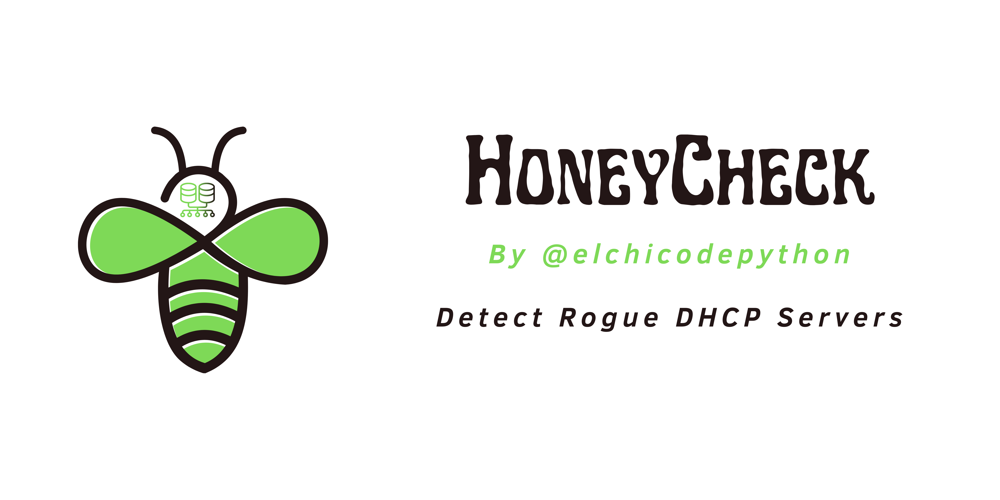

# HoneyCheck - Detect Rogue DHCP Servers in your network



Honeycheck detects rogue dhcp servers and provides a modular and fully
configurable action environment in case they are found.

If you want a quick setup and you have a Raspberry-Pi go directly to [Raspberry
Pi Images section](#raspberry-pi-images).

### Doc Index

- [System requirements](#system-requirements)
- [System configuration](#system-configuration)
- [Honeycheck installaton](#honeycheck-installation)
- [Running honeycheck](#running-honeycheck)
- [Donations and Sponsorships](#donations-and-sponsorships)


## System requirements

```bash
apt-get install -y python3 virtualenv bridge-utils tcpdump
```

## System configuration

HoneyCheck needs to configure the interface that we are going to configure in
bridge mode.

This can be configured in the /etc/network/interfaces file:
https://wiki.debian.org/BridgeNetworkConnections#Configuring_bridging_in_.2Fetc.2Fnetwork.2Finterfaces

In the following text, it goes from there with the adaptation that in our case
we only want to make a bridge per interface to be able to control them
independently.

## Honeycheck Installation

```bash
pip install honeycheck
```

## Running Honeycheck

Once configured, we restart the networking service and proceed to configure the
application.

Once Honeycheck is configured it can be started running `python3 -m honeycheck
-c our_conf_file.ini`

## Donations and Sponsorships


### Donations from people/companies

If this tool is useful to you, please consider making a donation to support my
work.

Donations allow me to continue developing open source software to contribute
and grow our community.

I wish some day I could focus only on creating quality open source with a
strong community
supporting my projects.

You support me on https://ko-fi.com/elchicodepython.

### Sponsorships

If your company uses this tool and would like it to have a specific feature,
your company can sponsor its development.

To sponsor the development of a feature [contact
me](https://es.linkedin.com/in/sam-sec).

### Product integration advertising

If you want the integration of this tool with your solution to appear in this
Readme, [contact me](https://es.linkedin.com/in/sam-sec).

